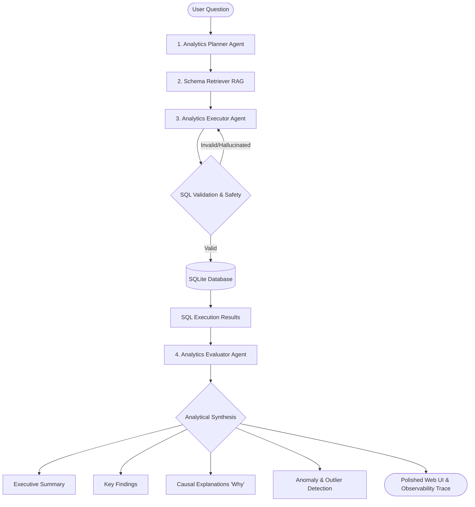

# AI Data Analyst Agent ⚡

An enterprise-grade, multi-agent analytics platform that performs autonomous, schema-aware data analysis on structured SQLite databases using a robust **Plan-Execute-Evaluate** loop. The platform features an intelligent, cascading LLM failover engine (Groq ⇄ Ollama), a completely non-blocking asynchronous FastAPI backend, and a premium interactive user interface designed to provide senior-level analytical insights.

---

## 🚀 The One-Line Pitch
> "An autonomous multi-agent platform that reasons over complex structured databases to answer analytical business questions with full trace logging, automated SQL validation, and rigorous confidence evaluation."

---

## 🏗️ System Architecture & Workflow

The platform coordinates three specialized agents and a semantic search system to ensure safe, accurate, and self-correcting database query execution:



### 1. Analytics Planner Agent (`AnalyticsPlannerAgent`)
*   **Role**: Senior business analyst.
*   **Behavior**: Decomposes the user's natural language question into logical, high-impact analytical steps.
*   **Context-Aware**: Prioritizes retrieving the database schemas first so that it only plans steps supported by actual table definitions, preventing hallucinations and keeping token footprints minimal.

### 2. Schema Retriever RAG (`SchemaRetriever`)
*   **Role**: Contextual knowledge vector-db.
*   **Behavior**: Embeds database schemas and queries using `sentence-transformers` and index matches them inside `FAISS`. It finds the top-k table schemas that are semantically relevant to each individual analytical step.

### 3. Analytics Executor Agent (`AnalyticsExecutorAgent`)
*   **Role**: Elite SQL engineer.
*   **Behavior**:
    *   Generates read-only SQLite SQL queries matching only the columns and tables in the schema context.
    *   **SQL Linter & Safe Sandbox**: Checks all statements to block destructive keywords (`INSERT`, `DELETE`, `DROP`, `UPDATE`, `ALTER`).
    *   **Self-Correction**: Automatically captures SQLite execution exceptions and feeds them back into the LLM context for iterative, automated self-correction (retries).
    *   **Contextual Fallbacks**: Features high-fidelity database-specific SQL mappings tuned directly for the Olist dataset to serve valid analytical metrics even if all LLM servers are unavailable.

### 4. Analytics Evaluator Agent (`AnalyticsEvaluatorAgent`)
*   **Role**: Senior analytical validator.
*   **Behavior**: Reviews the query trace, executes logical consistency checks, and compiles the final report, generating:
    *   **Causal Explanations ("Why")**: Providing the context and business rationale behind data trends.
    *   **Automated Anomaly Detection**: Finding irregular spikes, drops, or outlier values in the database output.
    *   **Confidence Justification**: Dynamically scoring the execution certainty based on query safety and the presence of validated SQL-backed evidence.

---

## ✨ Key Advanced Features

### 🔄 Resilient LLM Cascade & Failover Engine
*   **Multi-Model Groq Cascading**: Custom REST wrapper (`GroqClient`) implemented with standard `urllib.request`. If the primary model (e.g. `GROQ_MODEL=qwen/qwen3-32b`) is rate-limited or fails, it cascades through a backup sequence (`qwen-2.5-32b` ➔ `llama-3.1-8b-instant` ➔ `llama-3.3-70b-versatile`). It parses raw HTTP error messages for advanced troubleshooting.
*   **Local Ollama Failover**: Built-in fallback to local `ollama` endpoints (default model: `qwen2.5-coder:7b`).
*   **Cached Reachability Checks**: The Ollama status endpoint checks are cached for 60 seconds to avoid repeating network requests on every routing call, ensuring zero latency overhead.
*   **Model Isolation (`FallbackLLMClient`)**: Set `LLM_PROVIDER=auto` to automatically run Groq as primary and failover to Ollama as a safety net.

### ⚡ Non-Blocking Async Backend Server
*   **Async Thread Isolation**: Solves FastAPI blockages during long agent execution times. By wrapping `service.analyze(question)` in `asyncio.to_thread` with an isolated event loop, uvicorn continues running concurrently.
*   **Real-Time Progress Endpoint**: A dedicated `/tasks/progress` endpoint.
*   **Dynamic Observer Interception**: Leverages custom monkeypatched listeners intercepting agent hooks (`on_run_start`, `on_step_start`, `on_step_end`) to write detailed progress state directly to the front-end in real-time.

### 💎 High-Fidelity Premium UI Dashboard
*   **Dynamic Progress Bar**: Fetches live agent updates every 500ms, replacing static loaders with a responsive, step-by-step progress monitor.
*   **Olist High-Fidelity Data Preview**: Integrated instant, high-fidelity table lookups on the frontend (`MOCK_TABLE_DATA`) showcasing real Olist schemas (`customers`, `orders`, `products`, `order_items`) to offer sub-millisecond previews without database locking.
*   **Stunning Aesthetics**: Elegant layout with deep dark-mode tones, vibrant gradients, glassmorphism containers, structured SQL code blocks, and visual analytical grids.

---

## 🛠️ Technology Stack
*   **Backend**: Python 3.11+, FastAPI, Uvicorn
*   **LLM Clients**: Raw custom clients wrapping Groq REST API & Ollama local server APIs.
*   **Vector Engine**: FAISS (Facebook AI Similarity Search), SentenceTransformers (`all-MiniLM-L6-v2`)
*   **Database**: SQLite
*   **Frontend**: HTML5, Vanilla JavaScript (ES6+), Premium Custom HSL CSS

---

## 🏃 How to Run the Platform (Step-by-Step)

Follow these exact steps to set up and run the platform on your system:

### 1. Setup Environment & Install Dependencies
Ensure you have Python 3.11+ installed. Create a clean virtual environment and install the package:

```bash
# Clone the repository
git clone https://github.com/your-username/End-To-End-AI-Agent-Platform.git
cd "End To End AI Agent Platform"

# Create a virtual environment
python -m venv venv

# Activate the virtual environment
# On Windows (PowerShell):
.\venv\Scripts\Activate.ps1
# On Windows (Command Prompt):
.\venv\Scripts\activate.bat
# On macOS/Linux:
source venv/bin/activate

# Install the project in editable developer mode
pip install -e .
```

### 2. Configure Environment Variables (`.env`)
Create a `.env` file in the root workspace directory and fill out the configuration:

```env
# 1. API Keys
GROQ_API_KEY=your-actual-groq-api-key-here

# 2. LLM Configuration
# Options: 'auto' (Cascades Groq -> Ollama), 'groq' (Only Groq), 'ollama' (Only local Ollama)
LLM_PROVIDER=auto
GROQ_MODEL=qwen/qwen3-32b
OLLAMA_MODEL=qwen2.5-coder:7b
OLLAMA_BASE_URL=http://localhost:11434/api/chat

# 3. System Paths & Settings
ANALYTICS_DB_PATH=runtime/analytics.db
TRACE_JSONL_PATH=runtime/traces.jsonl
LOG_LEVEL=INFO
```

### 3. Automatically Seed the SQLite Database
The SQLite database contains real e-commerce data from the Kaggle Olist Brazilian E-Commerce dataset. If `runtime/analytics.db` does not exist, starting the FastAPI server will **automatically seed** it for you!

To run a manual seed in Python:
```bash
python -c "from agent_platform.data.seed_data import seed_database; from pathlib import Path; seed_database(Path('runtime/analytics.db'))"
```

### 4. Run the Backend API Server
Start the FastAPI backend server using Uvicorn. The backend automatically serves the API endpoints and mounts the static frontend:

```bash
python -m uvicorn apps.api.main:app --reload --host 127.0.0.1 --port 8000
```
*   **FastAPI API Swagger Docs**: Navigate to [http://127.0.0.1:8000/docs](http://127.0.0.1:8000/docs)
*   **Stunning Dashboard UI**: Open [http://127.0.0.1:8000/ui/index.html](http://127.0.0.1:8000/ui/index.html) (or double click `apps/ui/index.html` to open in browser).

### 5. Run a CLI-Based Agent Analysis (Alternative)
You can run the agentic workflow directly from the command line using `run_analysis.py`:

```bash
python run_analysis.py "Why did revenue drop in March?"
```
*Replace the question argument to run custom queries like:*
*   `python run_analysis.py "Show the top 5 products by sales"`
*   `python run_analysis.py "Which customer states drive the highest revenue?"`

---

## 📁 Codebase Directory Structure
```text
End To End AI Agent Platform/
├── apps/
│   ├── api/
│   │   └── main.py              # FastAPI app, /tasks/progress, and monkeypatched observers
│   └── ui/
│       ├── index.html           # Premium glassmorphism HTML structure
│       ├── index.css            # Dark mode variables, styling, animations
│       └── app.js               # Frontend fetch, progress poller, mock data tables
├── data/                        # Contains raw datasets and seeding components
├── runtime/                     # Generated database, RAG vector indexes, and JSONL traces
├── src/
│   └── agent_platform/
│       ├── analytics/
│       │   ├── agents.py        # AnalyticsPlannerAgent, AnalyticsExecutorAgent, AnalyticsEvaluatorAgent
│       │   └── service.py       # Orchestrates the service layers and observer trackers
│       ├── infra/
│       │   └── cache.py         # Memory caching layer
│       ├── llms/
│       │   ├── client.py        # Fallback orchestration client
│       │   ├── groq_client.py   # Cascading REST models Groq wrapper
│       │   ├── ollama_client.py # Local Ollama JSON completions wrapper
│       │   └── prompts...       # Planner, SQL, and Evaluator prompts
│       ├── orchestration/       # Task execution state trackers
│       └── rag/                 # FAISS vector database retriever
├── run_analysis.py              # Command-line analytics interface
└── pyproject.toml               # Unified project metadata and Python dependencies
```

---
*Built with ❤️ for Enterprise Data Teams & Professional AI Engineers*
