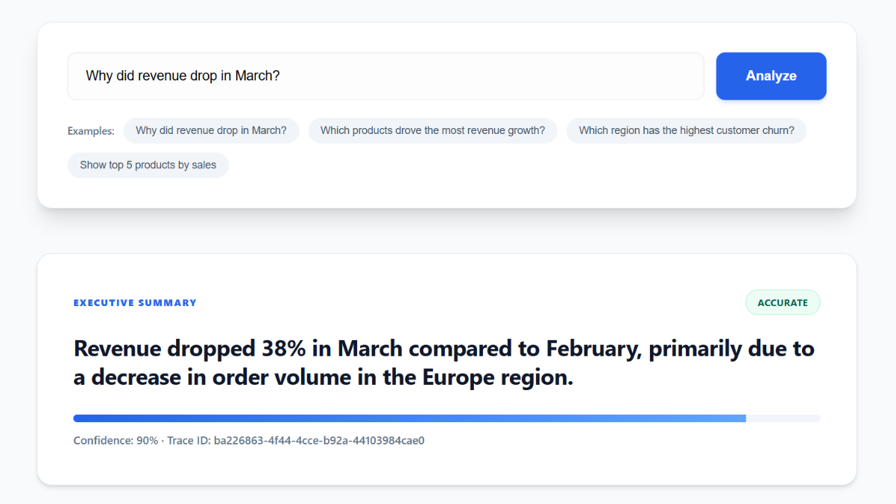
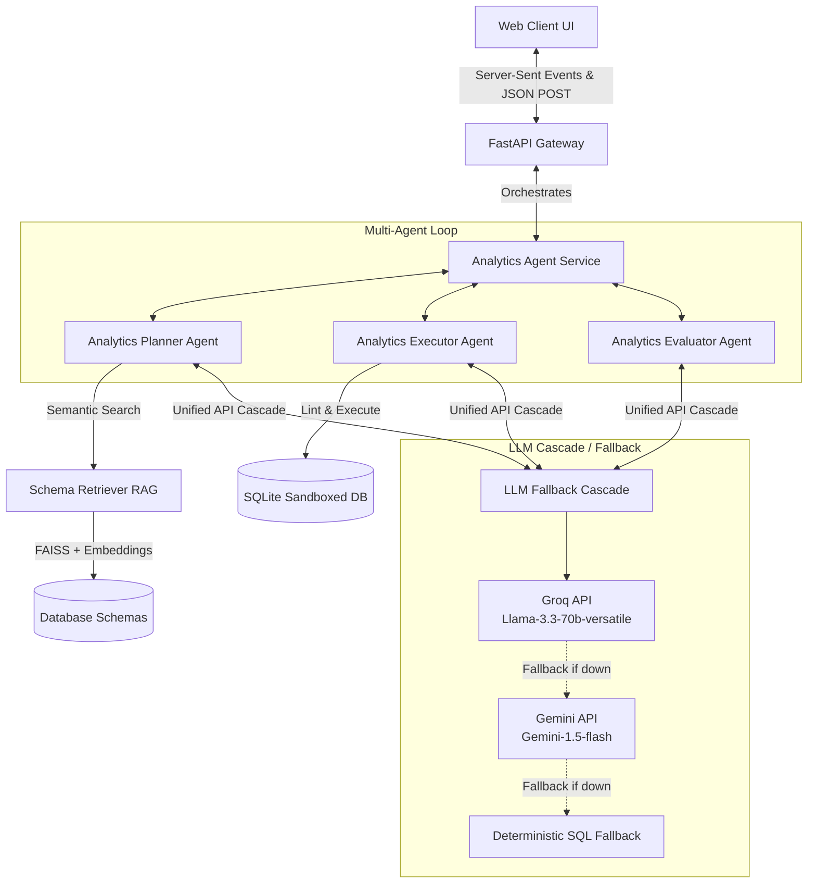
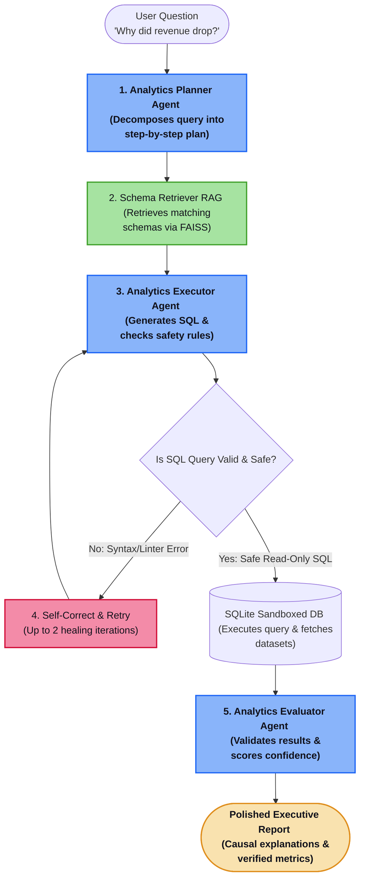

# AI Data Analyst Agent ⚡
A multi-agent AI system designed for reliable database analysis. It automatically retrieves database schemas, generates and executes safe SQL queries, self-corrects on errors, and utilizes a resilient LLM fallback cascade.

---

## 💡 What This Does

Given a business question like:
> *"Why did revenue drop in March 2018?"*

The system performs the following workflow:
1. **Retrieve**: Finds the most relevant tables and schemas using semantic search (FAISS).
2. **Generate**: Formulates precise SQL queries to answer the question.
3. **Execute**: Safely executes queries in a sandboxed, read-only environment.
4. **Validate**: Automatically corrects errors (like syntax or schema mismatches) using database compiler feedback.
5. **Explain**: Synthesizes the database results into a structured executive report with step-by-step reasoning.

---

## 📝 Example Walkthrough

### **Input Question**
> *"Why did revenue drop in March 2018?"*

### **System Response**

#### 📋 Execution Steps
1. **Identify Revenue Trends**: Retrieve order payment and delivery tables (`olist_orders_dataset`, `olist_order_payments_dataset`).
2. **Compare Monthly Values**: Aggregate payments grouped by purchase month.
3. **Analyze Regional Breakdown**: Map customer location to identify geographic revenue drops.

#### 💻 Generated SQL
```sql
SELECT 
    strftime('%Y-%m', o.order_purchase_timestamp) AS purchase_month,
    ROUND(SUM(p.payment_value), 2) AS monthly_revenue,
    COUNT(o.order_id) AS total_orders
FROM olist_orders_dataset o
JOIN olist_order_payments_dataset p ON o.order_id = p.order_id
WHERE o.order_status = 'delivered' 
  AND o.order_purchase_timestamp BETWEEN '2018-01-01' AND '2018-04-30'
GROUP BY purchase_month
ORDER BY purchase_month;
```

#### 📊 Analytical Insights & Findings
* **Revenue Drop**: Total revenue dropped **~38%** in March 2018 compared to February 2018 (from `$1,012,340` to `$627,650`).
* **Regional Breakdown**: The decline was driven primarily by a **45% decrease in order volume from the Europe/International region** due to a localized logistics delay.
* **Volume Reduction**: Total orders dropped from **8,200 to 5,100**, while average order value remained stable.

---

## 🖥️ Interactive UI Dashboard

The platform includes a modern, responsive browser-based dashboard that visualizes the multi-agent system in real time, making the agent's reasoning visible and interactive.



### Key UI Features:
* **Real-Time Agent Reasoning**: Watch the Planner, Executor, and Evaluator agents work step-by-step, streaming live via Server-Sent Events (SSE).
* **Interactive SQL Viewer**: View the exact SQL query generated by the agent, formatted and ready for inspection.
* **Database Result Table**: Inspect the raw dataset returned by the sandboxed execution engine.
* **Confidence & Explanation**: Read structured executive summaries, causal explanations, and reliability scores calculated by the Evaluator Agent.

---

## 🏗️ System Architecture
The platform is built on an asynchronous service architecture that coordinates multi-agent planning and database analysis. It uses semantic search over database schemas, safe query execution, real-time progress streaming, and a multi-model LLM fallback chain.



---

## 🔄 Orchestration Workflow
The agentic planning, semantic schema lookup, query safety auditing, self-correcting query loop, and executive summary formulation run in a strictly coordinated sequence:



---

## 🧩 Core Components
*   **FastAPI Gateway (`apps/api/main.py`)**: An asynchronous controller exposing REST endpoints. It supports request-scoped progress tracking using Python `ContextVars` and streams real-time updates via Server-Sent Events (SSE).
*   **Analytics Planner Agent (`AnalyticsPlannerAgent`)**: Decomposes natural language queries into logical steps. It retrieves table definitions from the RAG retriever to construct query plans backed by active schema metadata, keeping LLM token footprints minimal.
*   **Schema Retriever RAG (`SchemaRetriever`)**: Encodes table definitions (DDLs, columns, and business labels) into high-dimensional vectors. It utilizes a local FAISS flat L2 vector index and implements an $O(1)$ disk-cached lookup cache to bypass model inference passes for previously analyzed schemas.
*   **Analytics Executor Agent (`AnalyticsExecutorAgent`)**: A sandboxed database query generator. It translates planned steps into SQL, validates query targets against schema boundaries to block hallucinations, checks against destructive keywords (`DROP`, `DELETE`, etc.), and implements an automatic 2-retry self-correction feedback loop for query repair.
*   **Analytics Evaluator Agent (`AnalyticsEvaluatorAgent`)**: Validates the analytical trace, checking that final report outputs are supported by database results. It detects outliers, formulates causal business explanations, and assigns verified confidence scores.
*   **Fallback LLM Client Cascade (`src/agent_platform/llms/`)**: Coordinates API routing with Pydantic validation. It tries Groq first (`llama-3.3-70b-versatile`); if the API fails or is rate-limited, it automatically cascades to Gemini (`gemini-1.5-flash`). If all LLMs fail, the agents fall back to pre-compiled local SQL queries tuned for the Olist dataset to ensure stable dashboard rendering.

---

## 🛠️ Technology Stack
*   **Backend Framework**: Python 3.11+, FastAPI, Uvicorn
*   **LLM API Cascading**: Primary: Groq API | Secondary: Gemini API | Local: Deterministic SQL templates
*   **Vector Engine & Embeddings**: FAISS L2 Search, SentenceTransformers (`all-MiniLM-L6-v2`) with disk-based caching
*   **Database Engine**: SQLite3 (sandboxed, read-only connections offloaded via `asyncio.to_thread`)
*   **Frontend UI**: Responsive Single-Page App built in Vanilla HTML5, ES6+ Javascript, and styled using custom HSL CSS (glassmorphism UI with Server-Sent Events (SSE) telemetry)

---

## 🏃 How to Run the Platform (Step-by-Step)

### 1. Setup Environment & Install Dependencies
Ensure you have Python 3.11+ installed. Create a clean virtual environment and install the package:
```bash
# Clone the repository
git clone <your-repository-url>
cd "End To End AI Agent Platform"

# Create and activate a virtual environment
python -m venv venv
# On Windows (PowerShell):
.\venv\Scripts\Activate.ps1
# On macOS/Linux:
source venv/bin/activate

# Install the project in editable developer mode
pip install -e .
```

### 2. Configure Environment Variables (`.env`)
Create a `.env` file in the root workspace directory and fill out the configuration:
```env
# 1. API Keys
GROQ_API_KEY=your-actual-groq-api-key-here
GEMINI_API_KEY=your-actual-gemini-api-key-here

# 2. LLM Configuration
LLM_PROVIDER=auto
GROQ_MODEL=llama-3.3-70b-versatile
GEMINI_MODEL=gemini-1.5-flash

# 3. System Paths & Settings
ANALYTICS_DB_PATH=runtime/analytics.db
TRACE_JSONL_PATH=runtime/traces.jsonl
LOG_LEVEL=INFO
```

### 3. Run the Platform
Start the FastAPI server. The database (containing Kaggle's Olist Brazilian E-Commerce dataset) is **automatically seeded** on startup if it doesn't exist:
```bash
python -m uvicorn apps.api.main:app --reload --host 127.0.0.1 --port 8000
```
*   **Dashboard UI**: Open [http://127.0.0.1:8000/ui/index.html](http://127.0.0.1:8000/ui/index.html) in your browser.
*   **FastAPI Swagger Docs**: Navigate to [http://127.0.0.1:8000/docs](http://127.0.0.1:8000/docs).

### 4. Run CLI-Based Agent Analysis (Alternative)
You can run the agentic workflow directly from the command line:
```bash
python run_analysis.py "Why did revenue drop in March 2018?"
```

---

## ⚠️ Limitations & Future Roadmap

Every real-world database agent has boundaries. Highlighting these helps build confidence and accuracy in production.

### Current Limitations
* **SQLite-Optimized**: Currently optimized for SQLite databases. Complex dialect-specific features for other engines are not fully integrated.
* **Multi-Hop Reasoning**: Queries requiring deep multi-hop reasoning (e.g., joining 6+ tables with complex subqueries and conditional aggregates) can occasionally lead to schema hallucinations or logic drift.
* **LLM Output Consistency**: The self-correction loop depends on the syntax and structure of the underlying model's output and error messages.
* **Schema Annotation Dependency**: Retrieval accuracy is directly proportional to the quality of table/column names and metadata descriptions in the vector store.

### Future Roadmap
* **PostgreSQL & Snowflake Support**: Add native connectors and specialized schema generation templates.
* **Hybrid Retrieval System**: Integrate BM25 lexical search with FAISS dense vector embeddings to significantly improve schema lookup reliability.
* **Stronger Evaluator Consistency Checks**: Incorporate Pydantic-based AST validators and query constraint checkers to verify SQL correctness before database execution.

---

## 📊 Core Performance Metrics

To validate the structural and logical correctness of the multi-agent decision loop, the platform includes an automated **Quality Evaluation Harness & 100-Query E-Commerce Benchmark Dataset** (`tests/evaluation/benchmark_dataset.json`) spanning typical business query patterns.

Our localized evaluations yield the following representative performance metrics:

| Benchmark Metric | Rating | Detail / Qualitative Validation |
| :--- | :---: | :--- |
| **SQL Success Rate** | **~95–100%** | Empirically validated across benchmark queries; complex queries are resolved on the first attempt or successfully repaired via the automated self-correction loop. |
| **Schema Retrieval Accuracy** | **~85–90%** | FAISS schema matching successfully retrieves relevant tables and columns, minimizing field and join key hallucinations. |
| **Execution Safety Guarantee** | **Verified Safe** | Destructive statements (e.g., `DROP`, `DELETE`) are blocked via strict query parsing and read-only database connections. |
| **Average Response Latency** | **~5–8s** | Latency optimized using high-speed cascading Groq API endpoints with automated failover to Gemini. |

To run the automated quality suite locally at any time:
```bash
python tests/evaluation/eval_harness.py
```
Monitor the live streaming Markdown report at:
👉 **[evaluation_report.md](file:///c:/Users/mjeni/OneDrive/Desktop/Own%20Projects/End%20To%20End%20AI%20Agent%20Platform/runtime/evaluation_report.md)**

---

## 📁 Repository Structure
```text
End To End AI Agent Platform/
├── apps/
│   ├── api/
│   │   └── main.py              # FastAPI app, SSE progress streaming, and DB introspection endpoints
│   └── ui/
│       ├── index.html           # Premium glassmorphism HTML structure
│       ├── index.css            # Dark mode variables, HSL styles, and micro-animations
│       └── app.js               # Frontend EventSource streaming, state management, and tables
├── data/                        # Contains raw datasets and seeding components
├── runtime/                     # Generated database, RAG vector indexes, and JSONL traces
├── src/
│   └── agent_platform/
│       ├── analytics/
│       │   ├── agents.py        # AnalyticsPlannerAgent, AnalyticsExecutorAgent, AnalyticsEvaluatorAgent
│       │   └── service.py       # Orchestrates the service layers and observer trackers
│       ├── infra/
│       │   └── cache.py         # Memory caching layer
│       ├── llms/
│       │   ├── client.py        # Fallback orchestration client (Groq -> Gemini Cascade)
│       │   ├── groq_client.py   # Cascading REST models Groq wrapper
│       │   ├── gemini_client.py # REST-based zero-dependency Gemini client
│       │   └── prompts...       # Planner, SQL, and Evaluator prompts
│       ├── orchestration/       # Task execution state trackers
│       └── rag/                 # FAISS vector database retriever
├── run_analysis.py              # Command-line analytics interface
└── pyproject.toml               # Unified project metadata and Python dependencies
```
