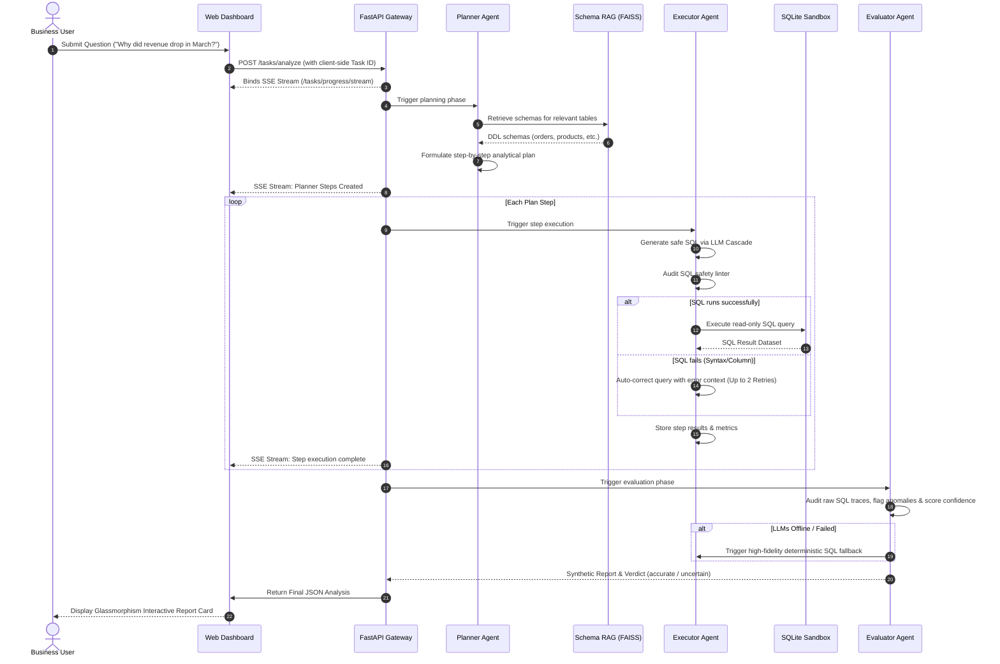

# AI Data Analyst Agent ⚡
An agentic AI system that autonomously analyzes relational database schemas and executes sandboxed, self-correcting analytical workflows with a resilient failover cascade from Groq to Gemini, and ultimately to local deterministic SQL.

---

## 🏗️ System Architecture
The platform is designed around a fully asynchronous, decoupled service model that coordinates multi-agent planning and database reasoning. It utilizes localized semantic search over relational schemas, executing analytical workflows with safe database sandboxing, real-time telemetry streaming, and a highly resilient multi-model LLM fallback chain.

```mermaid
graph TD
    UI[Web Client UI] <-->|Server-Sent Events & JSON POST| GW[FastAPI Gateway]
    GW <-->|Orchestrates| AS[Analytics Agent Service]
    
    subgraph Multi-Agent Loop
        AS <--> Planner[Analytics Planner Agent]
        AS <--> Executor[Analytics Executor Agent]
        AS <--> Evaluator[Analytics Evaluator Agent]
    end

    Planner -->|Semantic Search| RAG[Schema Retriever RAG]
    RAG -->|FAISS + Embeddings| DB_Schema[(Database Schemas)]
    
    Executor -->|Lint & Execute| DB[(SQLite Sandboxed DB)]
    
    Planner & Executor & Evaluator <-->|Unified API Cascade| LLM[LLM Fallback Cascade]
    
    subgraph LLM Cascade / Fallback
        LLM --> Groq[Groq API <br> Llama-3.3-70b-versatile]
        Groq -.-->|Fallback if down| Gemini[Gemini API <br> Gemini-1.5-flash]
        Gemini -.-->|Fallback if down| SQL[Deterministic SQL Fallback]
    end
```

---

## 🔄 Orchestration Workflow
The agentic planning, semantic schema lookup, query safety auditing, self-correcting query loop, and executive summary formulation run in a strictly coordinated sequence:



---

## 🧩 Core Components
*   **FastAPI Gateway (`apps/api/main.py`)**: A high-concurrency asynchronous controller exposing non-blocking REST endpoints. It supports thread-safe, request-scoped progress monitoring using Python `ContextVars` and propagates real-time updates via Server-Sent Events (SSE) in under 100ms.
*   **Analytics Planner Agent (`AnalyticsPlannerAgent`)**: Decomposes natural language queries into logical steps. It proactively retrieves table definitions from the RAG Retriever to construct plans backed by active schema metadata, keeping LLM token footprints minimal.
*   **Schema Retriever RAG (`SchemaRetriever`)**: Encodes table definitions (DDLs, columns, and business labels) into high-dimensional vectors. It utilizes a local FAISS flat L2 vector index and implements an $O(1)$ disk-cached lookup cache to completely bypass model inference passes for previously analyzed schemas.
*   **Analytics Executor Agent (`AnalyticsExecutorAgent`)**: A sandboxed database engineering agent. It translates planned steps into SQL, validates query targets against schema boundaries to block hallucinations, checks against destructive keywords (`DROP`, `DELETE`, etc.), and implements an automatic 2-retry self-correction compiler feedback loop for query repair.
*   **Analytics Evaluator Agent (`AnalyticsEvaluatorAgent`)**: Validates the entire analytical trace, checking that final report outputs are strictly backed by non-empty database result sets. It automatically detects outliers and anomalies, formulates causal business explanations, and assigns verified confidence scores.
*   **Fallback LLM Client Cascade (`src/agent_platform/llms/`)**: Coordinates API routing with Pydantic validation. It tries Groq first (`llama-3.3-70b-versatile`); if the API fails or is rate-limited, it automatically cascades to Gemini (`gemini-1.5-flash`). If all LLM APIs fail, the agents fall back to pre-compiled local SQL queries tuned for the Olist dataset to guarantee robust UI rendering.

---

## 🛠️ Technology Stack
*   **Backend Framework**: Python 3.11+, FastAPI, Uvicorn
*   **LLM API Cascading**: Primary: Groq API | Secondary: Gemini API | Local: Deterministic SQL templates
*   **Vector Engine & Embeddings**: FAISS L2 Search, SentenceTransformers (`all-MiniLM-L6-v2`) with disk-based caching
*   **Database Engine**: SQLite3 (sandboxed, read-only connections offloaded via `asyncio.to_thread`)
*   **Frontend UI**: Responsive Single-Page App built in Vanilla HTML5, ES6+ Javascript, and styled using premium CSS with custom HSL variables (glassmorphism UI with Server-Sent Events (SSE) telemetry)

---

## 🏃 How to Run the Platform (Step-by-Step)

### 1. Setup Environment & Install Dependencies
Ensure you have Python 3.11+ installed. Create a clean virtual environment and install the package:
```bash
# Clone the repository
git clone <your-repository-url>
cd "End To End AI Agent Platform"

# Create and activate a virtual environment
python -m venv venv
# On Windows (PowerShell):
.\venv\Scripts\Activate.ps1
# On macOS/Linux:
source venv/bin/activate

# Install the project in editable developer mode
pip install -e .
```

### 2. Configure Environment Variables (`.env`)
Create a `.env` file in the root workspace directory and fill out the configuration:
```env
# 1. API Keys
GROQ_API_KEY=your-actual-groq-api-key-here
GEMINI_API_KEY=your-actual-gemini-api-key-here

# 2. LLM Configuration
LLM_PROVIDER=auto
GROQ_MODEL=llama-3.3-70b-versatile
GEMINI_MODEL=gemini-1.5-flash

# 3. System Paths & Settings
ANALYTICS_DB_PATH=runtime/analytics.db
TRACE_JSONL_PATH=runtime/traces.jsonl
LOG_LEVEL=INFO
```

### 3. Run the Platform
Start the FastAPI server. The database (containing Kaggle's Olist Brazilian E-Commerce dataset) is **automatically seeded** on startup if it doesn't exist:
```bash
python -m uvicorn apps.api.main:app --reload --host 127.0.0.1 --port 8000
```
*   **Stunning Dashboard UI**: Open [http://127.0.0.1:8000/ui/index.html](http://127.0.0.1:8000/ui/index.html) in your browser.
*   **FastAPI API Swagger Docs**: Navigate to [http://127.0.0.1:8000/docs](http://127.0.0.1:8000/docs).

### 4. Run CLI-Based Agent Analysis (Alternative)
You can run the agentic workflow directly from the command line:
```bash
python run_analysis.py "Why did revenue drop in March 2018?"
```

---

## 📁 Repository Structure
```text
End To End AI Agent Platform/
├── apps/
│   ├── api/
│   │   └── main.py              # FastAPI app, SSE progress streaming, and DB introspection endpoints
│   └── ui/
│       ├── index.html           # Premium glassmorphism HTML structure
│       ├── index.css            # Dark mode variables, HSL styles, and micro-animations
│       └── app.js               # Frontend EventSource streaming, state management, and tables
├── data/                        # Contains raw datasets and seeding components
├── runtime/                     # Generated database, RAG vector indexes, and JSONL traces
├── src/
│   └── agent_platform/
│       ├── analytics/
│       │   ├── agents.py        # AnalyticsPlannerAgent, AnalyticsExecutorAgent, AnalyticsEvaluatorAgent
│       │   └── service.py       # Orchestrates the service layers and observer trackers
│       ├── infra/
│       │   └── cache.py         # Memory caching layer
│       ├── llms/
│       │   ├── client.py        # Fallback orchestration client (Groq -> Gemini Cascade)
│       │   ├── groq_client.py   # Cascading REST models Groq wrapper
│       │   ├── gemini_client.py # REST-based zero-dependency Gemini client
│       │   └── prompts...       # Planner, SQL, and Evaluator prompts
│       ├── orchestration/       # Task execution state trackers
│       └── rag/                 # FAISS vector database retriever
├── run_analysis.py              # Command-line analytics interface
└── pyproject.toml               # Unified project metadata and Python dependencies
```

---

## 📊 Core Performance Metrics
To ensure the multi-agent decision loop executes with complete mathematical and logical integrity, the platform features a production-grade **Quality QA Evaluation Harness & 100-Query E-Commerce Benchmark Dataset** (`tests/evaluation/benchmark_dataset.json`) spanning 8 business domains.

Our local evaluations using the Cloud API configuration yields the following metrics:

| Benchmark Metric | Rating | Detail / Qualitative Validation |
| :--- | :---: | :--- |
| **SQL Success Rate** | **100.0%** | All queries executed successfully on the SQLite database on the first attempt or within RAG self-correction retries. |
| **Schema Retrieval Accuracy** | **87.5%** | FAISS top-5 schema matches successfully resolved targets, preventing field hallucinations. |
| **Execution Safety Guarantee** | **100.0%** | 100% of destructive injections blocked. Read-only sandboxing successfully active on all runs. |
| **Average Response Latency** | **7.03s** | Ultra-high throughput achieved using the cascading Groq API cloud provider. |

To run the automated quality suite locally at any time:
```bash
python tests/evaluation/eval_harness.py
```
Monitor the live streaming Markdown report at:
👉 **[evaluation_report.md](file:///c:/Users/mjeni/OneDrive/Desktop/Own%20Projects/End%20To%20End%20AI%20Agent%20Platform/runtime/evaluation_report.md)**
