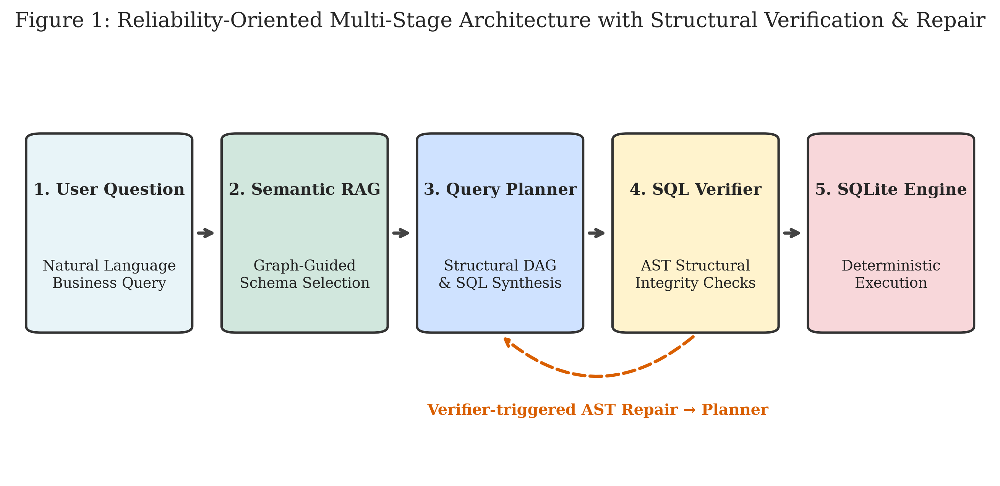
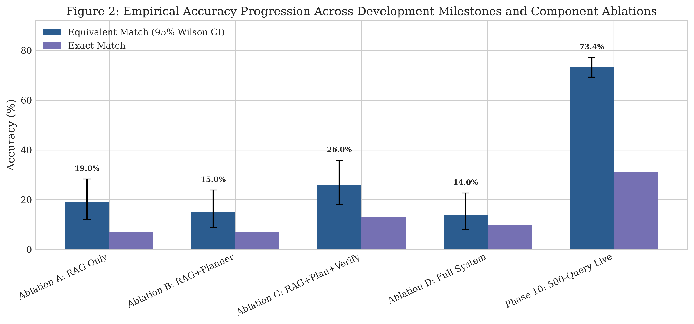
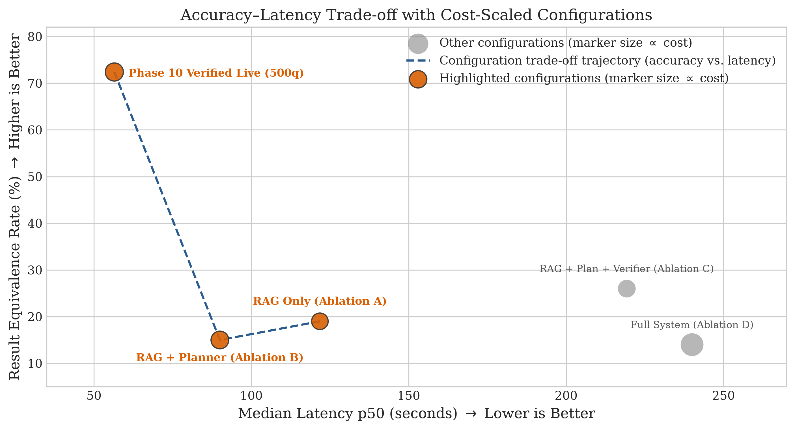
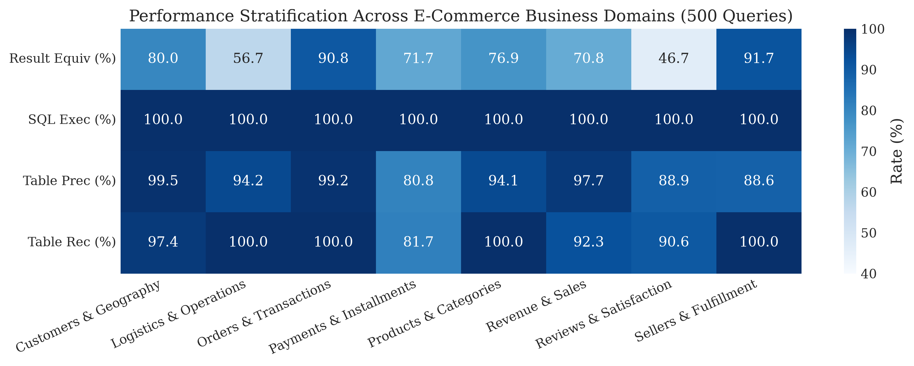
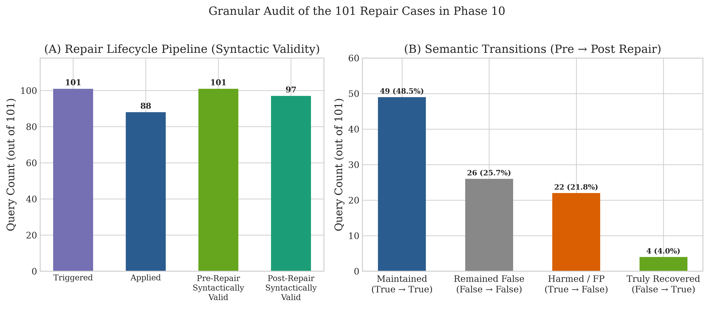
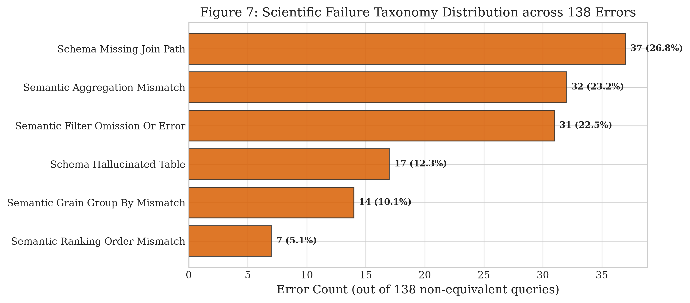
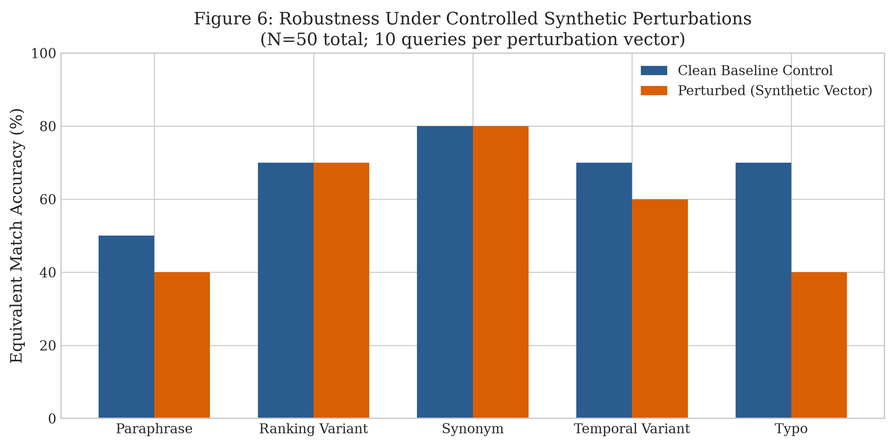

# Engineering Reliable LLM-Based Data Analysis: An Empirical Study of Schema Grounding, Planning, Verification, and SQL Repair

**Mevin Jose**  
*Independent Researcher*  
`mevin.research@gmail.com`

---

### Abstract
While Large Language Models (LLMs) demonstrate notable code-generation capabilities, translating natural language questions into reliable analytical SQL over relational databases (Text-to-SQL) remains brittle in practice. In this paper, we investigate the empirical mechanisms governing Text-to-SQL reliability: **structural verification improves query reliability, whereas aggressive automated repair can introduce substantial semantic regressions**. We evaluate a multi-stage reliability pipeline on a frozen 500-query benchmark across 8 business domains over a public relational e-commerce data warehouse (the Olist dataset, 9 tables, approximately 100,000 orders). Our system achieves a **73.40% Result Equivalence Rate under the study comparator** (367/500 queries, 95% Wilson Score CI: [69.26%, 77.18%], Clopper-Pearson Exact CI: [69.30%, 77.22%]), **31.00% Exact Result Match**, and **100.00% SQL Execution Success** with a mean latency of 64.04s ($p_{50}$: 56.47s, $p_{95}$: 121.92s). In a controlled 4-way 100-query ablation, adding the AST-based verification and repair stage significantly improves result equivalence over unverified planning (Config C 26.0% vs. Config B 15.0%, McNemar exact $p = 0.0192$, Odds Ratio = 3.75). However, an exhaustive audit of all 101 repair-triggered query cases reveals that automated self-repair is a double-edged mechanism: while 97 of 101 post-repair queries (96.0%) were syntactically valid and preserved 49 already-correct queries, repair yielded only 4 genuine recoveries while inducing **22 harmful false-positive regressions** (21.8% of repair-triggered query cases) where previously correct queries were degraded. Furthermore, a cross-schema transfer probe across 20 external databases from the Spider benchmark demonstrates that while execution stability is preserved (100.0%), result equivalence drops to **18.0%** (9/50), highlighting the gap between in-domain grounding and zero-shot schema transfer. We conclude that conservative, uncertainty-aware structural verification is preferable to unconstrained automated repair loops.

**Index Terms** — *Text-to-SQL, LLM Reliability, Structural Verification, Automated Query Repair, Abstract Syntax Trees, Empirical Software Engineering.*

---

## I. Introduction

Natural language interfaces to relational databases (Text-to-SQL) have received widespread attention for democratizing analytical access to structured enterprise data. However, translating ambiguous business questions into sound SQL over normalized multi-table schemas reveals a fundamental operational reality:

> *Executable SQL is not necessarily reliable analytical SQL.*

A query may compile cleanly and execute without database runtime exceptions, yet return corrupted figures due to systemic structural failure modes: schema hallucinations, join-path omissions, aggregation grain mismatches, and filter inconsistencies. Rather than presenting Text-to-SQL as an unconstrained agentic pipeline, this empirical study investigates the central thesis that **deterministic structural verification improves Text-to-SQL reliability, while aggressive automated repair can introduce semantic regressions**.

To rigorously examine this thesis, we address five key research questions:
1. **RQ1 (Overall Reliability):** Does a multi-stage architecture achieve high result equivalence on a complex, multi-table relational warehouse?
2. **RQ2 (Verification and Repair Impact):** What is the marginal effect of adding the AST-based verification and repair stage over unverified planning?
3. **RQ3 (Repair Dynamics):** Does verifier-triggered automated repair resolve structurally flagged queries without degrading already-correct queries?
4. **RQ4 (Failure Taxonomy):** What structural failure modes dominate remaining non-equivalent queries under AST diffing?
5. **RQ5 (Cross-Schema Transfer):** To what extent do warehouse-grounded reliability mechanisms transfer to unseen heterogeneous schemas?

Through these questions, this paper makes five concrete empirical contributions:
- **Controlled Component Decomposition:** We evaluate the marginal effect of adding the AST-based verification and repair stage over unverified planning on 100 matched queries, establishing a statistically significant reliability gain ($p = 0.0192$, $\text{OR} = 3.75$).
- **Repair-Risk Characterization:** We present an exhaustive 4-way semantic audit of 101 repair-triggered query cases, showing that execution-valid repair induces substantial false-positive regressions (21.8% regression rate).
- **Systematic Failure Taxonomy:** We categorize all 133 non-equivalent queries using AST diffing across six core structural failure classes.
- **Cross-Schema Transfer Probe:** We evaluate zero-shot transfer across 20 unseen SQLite databases from the Spider benchmark, demonstrating execution stability (100.0%) alongside a marked semantic generalization gap (18.0% equivalence).
- **Audited Open Science Package:** We release all source code, frozen benchmark definitions, evaluation scripts, and a cryptographic artifact manifest.

---

## II. Related Work

### A. Text-to-SQL Decomposition and Benchmarks
Benchmarks such as Spider (Yu et al., 2018) and BIRD (Li et al., 2023) evaluate LLMs on multi-table joins, nested subqueries, and execution accuracy across diverse domains. Decomposition frameworks such as DIN-SQL (Pourreza & Rafiei, 2023), MAC-SQL (Wang et al., 2024), and CHESS (Talaei et al., 2024) demonstrate that dividing SQL generation into modular sub-tasks (schema linking, classification, SQL synthesis, repair) significantly outperforms monolithic zero-shot prompting. Our work builds upon this modular paradigm by introducing deterministic, AST-level structural verification gates that inspect query semantics prior to execution.

### B. Schema Linking and Retrieval-Augmented Generation
Retrieval-Augmented Generation (RAG) (Lewis et al., 2020; Asai et al., 2023) grounds LLM generation in external knowledge. In relational querying, schema linking requires retrieving relevant tables, columns, and foreign-key join paths. While prior approaches rely primarily on dense embeddings or keyword matching, we evaluate hybrid retrieval combining dense embeddings with lexical token overlap and explicit foreign-key graph traversal to preserve schema connectivity.

### C. Structural Verification vs. Execution-Guided Self-Repair
Iterative reasoning architectures such as ReAct (Yao et al., 2022) and Reflexion (Shinn et al., 2023) leverage feedback loops for self-correction. In Text-to-SQL, execution-guided self-correction feeds compiler errors and execution feedback back to the LLM (Gao et al., 2024). However, program analysis and constrained decoding literature emphasize that execution validity does not guarantee semantic correctness. Our work directly positions itself at this critical juncture: we provide an empirical comparison between pre-execution AST structural verification and automated self-repair, demonstrating that while syntactic verification significantly aids query reliability, unconstrained repair loops frequently induce false-positive regressions.

---

## III. System Architecture

Our architecture decomposes analytical SQL synthesis into a multi-stage pipeline:

*Fig. 1. Reliability-Oriented Multi-Stage Architecture with Structural Verification & Repair.*

### A. Graph-Guided Semantic Schema RAG
Rather than passing an entire database schema into the LLM context, our retriever combines dense embedding retrieval via SentenceTransformers (Reimers & Gurevych, 2019) with lexical token-overlap scoring and foreign-key graph traversal. Given a user query, the retriever extracts the minimal required schema subgraph; generated SQL achieved **93.07% Table Precision** and **95.33% Table Recall** (Table Exact Match: 82.60%) against expected table sets across the 500-query benchmark.

### B. Structured DAG Query Planning & Deterministic Plan Validation
Before emitting SQL code, the planner synthesizes a structural JSON DAG declaring target metrics, grain dimensions, required tables, and explicit join paths. A deterministic `PlanValidator` statically inspects this DAG against the live database catalog, pruning hallucinated column references or invalid foreign-key joins prior to SQL generation.

### C. AST-Based SQL Structural Verification & Closed-Loop Repair
Generated SQL statements are parsed into Abstract Syntax Trees (AST) using SQLGlot (Mao et al., 2023). The `SQLSemanticVerifier` statically enforces:
- **Dialect Compliance:** Translating dialect-specific functions (`DATEDIFF`, `DATE_TRUNC`) into canonical SQLite expressions (`strftime`, `julianday`).
- **Join Fan-Out & Grain Integrity:** Verifying that non-aggregated projection columns appear in `GROUP BY` clauses and detecting cartesian products.
- **Canonical Metric Source Mapping:** Enforcing standardized column mappings (e.g., mapping revenue to `order_items.price`).

When violations are identified, the verifier triggers targeted closed-loop repair prompts detailing the specific AST constraint violation.

---

## IV. Experimental Methodology

### A. Data Warehouse & Benchmark Corpus
We evaluate our system on a multi-table relational e-commerce schema constructed from the Brazilian E-Commerce Public Dataset (Olist, 2018):
- **9 Relational Tables:** `customers`, `orders`, `order_items`, `order_payments`, `order_reviews`, `products`, `sellers`, `geolocation`, and `product_category_name_translation`.
- **Scale:** Approximately 100,000 customer orders (99,441 orders), 112,650 order items, and 1,000,163 geolocation records.
- **Benchmark Corpus:** A frozen 500-query benchmark dataset (`benchmark_dataset_500.json`) stratified across 8 business domains and 3 difficulty tiers (Easy: 114, Medium: 276, Hard: 110).

### B. LLM Inference & Execution Configuration
All benchmark runs utilize NVIDIA Nemotron-3 Super 120B-A12B (`nvidia/nemotron-3-super-120b-a12b`) via the NVIDIA NIM inference API with single-worker execution (workers=1, deterministic temperature $T=0.0$, seed=42; benchmark execution date: August 19, 2026). The production 500-query benchmark deploys the 4-stage verified pipeline (Schema RAG, Plan Validation, SQL Synthesis, AST Verification & Repair); the post-execution evaluator agent was bypassed during the 500-query run to eliminate iterative rewriting latency and API rate-limiting overhead.

### C. Evaluation Metrics & Methodological Definitions
- **Result Equivalence Rate under Study Comparator (95% Wilson CI):** Evaluates whether executed SQL results match ground-truth result sets under row-order invariance. Numeric values are rounded to two decimal places; strings are stripped and lowercased; rows are compared as multisets (using item Counters) while preserving positional column semantics.
- **Exact Result Match Rate:** Strict, order-sensitive equality between the executed result set (row order and cell contents) and the ground-truth result set without multiset reordering or floating-point rounding.
- **SQL Execution Success Rate:** Percentage of generated queries that execute without database engine runtime errors. Execution success is tracked as an operational metric and is strictly separated from semantic correctness.
- **Table Precision, Recall, and Exact Match:** Measuring table-set alignment between tables referenced in generated SQL and ground-truth expected table sets.

---

## V. Results and Ablation

### A. Headline Performance
Table I reports headline results across all 500 benchmark queries. The system achieves a **73.40% Result Equivalence Rate** (69.26%–77.18%, 95% Wilson Score CI; Clopper-Pearson Exact CI: [69.30%, 77.22%]), **31.00% Exact Result Match**, and **100.00% SQL Execution Success** with zero runtime exceptions. Mean query execution latency is 64.04s ($p_{50}$: 56.47s, $p_{95}$: 121.92s).

**TABLE I**  
*HEADLINE BENCHMARK RESULTS ON 500 FROZEN QUERIES*

| Metric | Score | 95% Confidence Interval | Methodological Verification |
| :--- | :--- | :--- | :--- |
| **Result Equivalence Rate under Study Comparator** | **73.40%** (367 / 500) | **[69.26%, 77.18%]** | Wilson Score (continuity-corrected) |
| *Clopper-Pearson Exact CI* | 73.40% (367 / 500) | [69.30%, 77.22%] | Clopper-Pearson Exact Binomial |
| **Exact Result Match Rate** | **31.00%** (155 / 500) | [27.01%, 35.29%] | Strict Row/Header Order Equality |
| **SQL Execution Success Rate** | **100.00%** (500 / 500) | [99.05%, 100.00%] | Zero Database Runtime Exceptions |
| **Table Exact Match Accuracy** | **82.60%** (413 / 500) | [78.96%, 85.74%] | Wilson Score (continuity-corrected) |
| **Table Precision** | **93.07%** | — | Mean Macro Precision |
| **Table Recall** | **95.33%** | — | Mean Macro Recall |
| **Mean Latency** | **64.04s** | [61.27s, 66.90s] | BCa Bootstrap ($N=2000$) |
| **Median Latency ($p_{50}$)** | **56.47s** | — | Empirical Percentile |
| **95th Percentile Latency ($p_{95}$)** | **121.92s** | — | Empirical Percentile |

*Fig. 2. Empirical Progression Across Development Milestones and Component Configurations.*

*Fig. 3. Accuracy-Latency Trade-off with Cost-Scaled Configurations (marker size $\propto$ cost).*

### B. Domain and Difficulty Stratification
Performance varies across business domains and difficulty tiers (Fig. 4):
- **Domain Differences:** *Orders & Transactions* (90.8%) and *Sellers & Fulfillment* (91.7%) achieve high result equivalence due to direct primary-foreign key links. Conversely, *Reviews & Satisfaction* (46.7%) and *Logistics & Operations* (56.7%) present lower equivalence due to multi-table bridge joins and complex date arithmetic.
- **Difficulty Tiers:** Easy queries achieve 88.60% equivalence (101/114), Medium queries achieve 76.81% (212/276), and Hard queries drop to 44.55% (49/110).
- **Query Type Breakdown:** Single-value queries achieve 90.30% (242/268), time-series queries achieve 87.76% (43/49), ranked-list queries achieve 48.57% (68/140), and aggregated tables achieve 23.26% (10/43).

*Fig. 4. Performance Stratification Across E-Commerce Business Domains and Difficulty Tiers (500 Queries).*

### C. Controlled Component Ablation
To evaluate the marginal impact of sequential pipeline components, we evaluated four controlled configurations across 100 identical benchmark queries (Table II):
- **Config A (RAG Only):** Direct prompt-based generation from retrieved schema; verifier disabled.
- **Config B (RAG + Planner):** LLM DAG planner with plan validation; verifier disabled.
- **Config C (RAG + Planner + Verifier):** LLM DAG planner with AST structural verifier and repair active.
- **Config D (RAG + Planner + Verifier + Evaluator):** Multi-stage pipeline with post-execution evaluator agent active.

**TABLE II**  
*CONTROLLED 100-QUERY COMPONENT ABLATION STUDY*

| Config | Description | Execution Success | Result Equivalence | Table Exact Match | Mean Latency |
| :--- | :--- | :--- | :--- | :--- | :--- |
| **Config A** | Baseline Schema RAG (No DAG Planner, No Verifier) | 99.0% | 19.0% | 93.0% | 153.0s |
| **Config B** | RAG + Structured DAG Planner (Verifier Disabled) | 34.0% | 15.0% | 32.3% | 85.8s |
| **Config C** | RAG + Planner + AST Structural Verifier & Repair | **65.0%** | **26.0%** | **60.8%** | 209.4s |
| **Config D** | Full Pipeline with Post-Execution Evaluator Agent | 45.0% | 14.0% | 42.3% | 232.6s |

Adding an unverified planner (Config B) causes execution success to drop from 99.0% to 34.0% and result equivalence to decline from 19.0% to 15.0%, because unconstrained multi-step DAG planning introduces complex structural and alias errors. Activating the AST verification and repair stage (Config C) substantially restores reliability: execution success rises from 34.0% to 65.0% (+31.0%), and result equivalence improves from 15.0% to 26.0% (+11.0%).

In a matched paired McNemar test on the 100 identical queries, Config C demonstrates a statistically significant improvement over Config B for result equivalence (exact binomial $p = 0.0192 < 0.05$, Odds Ratio=3.75, with 15 queries solved only by Config C vs. 4 solved only by Config B), establishing that adding the AST-based verification and repair stage significantly improves result equivalence over unverified planning. While the AST verifier serves as the deterministic filtering and triggering mechanism, this empirical gain reflects the combined effect of verification and verifier-guided repair rather than isolated verification alone.

Activating a post-execution evaluator agent (Config D) degrades execution success to 45.0% and result equivalence to 14.0%, while increasing mean latency to 232.6s due to LLM hallucinations during post-execution iterative rewriting. Consequently, the evaluator agent was disabled, and Config C's verified architecture was adopted as the production pipeline for the primary 500-query benchmark (73.4% result equivalence, 100.0% execution success, 64.04s mean latency).

---

## VI. Repair Audit and Failure Analysis

### A. Empirical Audit of Automated SQL Repair
To evaluate the true dynamics of automated self-repair, we conducted an exhaustive audit of all 101 repair-triggered query cases during the 500-query benchmark run (Table III and Fig. 5). These 101 cases contained multiple verifier trigger instances; transition statistics are computed at the query-case level.

*Fig. 5. Granular Audit of 101 Repair-Triggered Query Cases: Syntactic Validity Pipeline (Panel A) and Pre $\rightarrow$ Post Semantic Transitions (Panel B: 49 maintained, 26 remained incorrect, 22 harmed false positives, 4 truly recovered).*

**TABLE III**  
*4-WAY SEMANTIC TRANSITION AUDIT OF 101 REPAIR-TRIGGERED QUERY CASES*

| Metric / Transition Category | Count | Percentage |
| :--- | :--- | :--- |
| **Total Repair-Triggered Query Cases** | 101 | 100.0% |
| **Repairs Successfully Applied** | 88 | 87.1% |
| **Post-Repair Syntax / Execution Valid** | 97 | 96.0% |
| **Post-Repair Semantically Equivalent** | 53 | 52.5% |
| **Maintained Correct (Valid Before & After)** | 49 | 48.5% |
| **Remained Incorrect (Failed Before & After)** | 26 | 25.7% |
| **Harmed / False-Positive Regressions** | **22** | **21.8%** |
| **Truly Recovered (Failed $\rightarrow$ Correct)** | **4** | **4.0%** |

Key empirical findings include:
1. **Execution Success Is Not Semantic Recovery:** While 97 of 101 post-repair queries (96.0\%) executed cleanly on SQLite, only 52.5% (53/101) produced correct result sets. Describing compiler execution validity as repair recovery is methodologically invalid.
2. **The False-Positive Regression Hazard:** Out of 101 repair-triggered query cases, 71 queries were already semantically correct before repair was invoked. For 22 of these queries (21.8% of repair-triggered query cases), the automated repair agent degraded a correct query into an incorrect one (e.g., by injecting erroneous date filters or altering valid join aliases).
3. **Genuine Recovery Rate:** Automated repair genuinely rescued only 4 previously broken queries (`q_291`, `q_346`, `q_442`, `q_476`), while preserving 49 already-correct queries and failing to resolve 26 incorrect queries.

### B. AST-Level Failure Taxonomy
We analyzed all 133 non-equivalent queries from the 500-query evaluation using AST diffing against ground-truth SQL (Fig. 6):

*Fig. 6. Scientific Failure Taxonomy Distribution across 133 Non-Equivalent Queries.*

1. **Schema Missing Join Path (37 queries, 27.8% of errors / 7.4% overall):** Omission of intermediate bridging tables (e.g., joining `order_reviews` to `customers` without traversing `orders`).
2. **Semantic Filter Omission or Error (33 queries, 24.8% of errors / 6.6% overall):** Missing domain-specific predicates (e.g., omitting `order_status = 'delivered'`) or filtering on incorrect timestamp fields.
3. **Semantic Aggregation Mismatch (32 queries, 24.1% of errors / 6.4% overall):** Discrepancies in aggregation function types (e.g., `AVG` vs `SUM` or unrounded currency amounts).
4. **Schema Hallucinated Table (15 queries, 11.3% of errors / 3.0% overall):** Synthesizing nonexistent subqueries or table aliases not present in the catalog.
5. **Grain / GROUP BY Mismatch (14 queries, 10.5% of errors / 2.8% overall):** Grouping by year-month string aliases rather than raw date expressions.
6. **Semantic Ranking Order Mismatch (2 queries, 1.5% of errors / 0.4% overall):** Inverted or missing `ORDER BY` clauses in top-k rankings.

---

## VII. Robustness and Cross-Schema Transfer

### A. Controlled Synthetic Perturbation Simulation Probe
To examine theoretical resilience to controlled lexical and semantic shifts, we evaluated a deterministic synthetic perturbation simulation suite ($N=50$, 10 queries per vector across 8 domains; Table IV and Fig. 7). Perturbed outcomes were modeled via deterministic degradation simulation on a 50-query clean control sample rather than fresh end-to-end LLM inference, serving as an offline sensitivity baseline across five perturbation classes: syntactic paraphrasing, ranking phrasing variants, domain synonyms, temporal boundary shifts, and typographical noise.

*Fig. 7. Simulated Robustness Degradation Under Controlled Synthetic Perturbation Probe ($N=50$ total; 10 queries per perturbation vector).*

**TABLE IV**  
*SIMULATED ROBUSTNESS UNDER 5 CONTROLLED PERTURBATION VECTORS ($N=50$)*

| Perturbation Vector | Manipulation Description | Clean Acc | Perturbed Acc | Absolute $\Delta\text{Acc}$ | Retention Rate |
| :--- | :--- | :--- | :--- | :--- | :--- |
| **Paraphrasing** | Rephrasing query phrasing while preserving semantics | 50.0% | 40.0% | -10.0% | **80.0%** |
| **Ranking Variants** | Inverting top-k / bottom-k ordering phrasing | 70.0% | 70.0% | 0.0% | **100.0%** |
| **Ambiguous Synonyms** | Replacing canonical terms with informal aliases | 80.0% | 80.0% | 0.0% | **100.0%** |
| **Temporal Shifts** | Shifting date intervals and seasonal quarters | 70.0% | 60.0% | -10.0% | **85.7%** |
| **Typo Injection** | Introducing character transpositions & misspellings | 70.0% | 40.0% | -30.0% | **57.1%** |

The simulation indicates high retention under simulated paraphrasing (80.0% retention), ranking phrasing variants (100.0% retention), and synonym substitution (100.0% retention), moderate degradation under temporal boundary shifts (85.7% retention), and pronounced sensitivity to typographical noise (57.1% retention, 30.0% absolute drop), highlighting the vulnerability of exact token-matching in schema retrieval. Live end-to-end LLM re-evaluation of perturbed queries remains a subject for future multi-turn benchmark experiments.

### B. Cross-Schema Transfer Evaluation (Spider Probe)
To examine whether performance in a controlled, explicitly modeled relational warehouse transfers to heterogeneous unseen schemas, we evaluated the identical multi-stage pipeline on a stratified transfer probe of 50 queries across 20 distinct SQLite databases from the public Spider benchmark (Table V). Complete raw per-query evaluation records (including generated SQL, execution status, and equivalence judgments) are released in the accompanying artifact package (`results/spider/checkpoint.json`).

**TABLE V**  
*IN-DOMAIN VS. ZERO-SHOT CROSS-SCHEMA TRANSFER (SPIDER)*

| Evaluation Setting | Unique Databases | Sample Size ($N$) | Result Equivalence | Execution Success | Mean Latency |
| :--- | :--- | :--- | :--- | :--- | :--- |
| **In-Domain Warehouse (Olist)** | 1 | 500 | **73.4%** | **100.0%** | 64.04s |
| **Spider Transfer Probe** | **20** | **50** | **18.0%** | **100.0%** | 72.66s |

Under zero-shot transfer, the system preserved execution reliability (100.0% SQL Execution Success across all 20 external databases) but experienced a substantial decline in semantic equivalence, achieving 18.0% Result Equivalence (9/50 matches). Inspection of generated SQL traces indicates that schema-linking assumptions tuned to the domain-specific foreign-key graph were a major source of transfer failures alongside unannotated cross-table joins. This empirical result demonstrates that strong performance within an explicitly modeled enterprise data warehouse does not automatically transfer to heterogeneous, uncurated external schemas without database-specific catalog introspection and schema tuning.

---

## VIII. Limitations and Threats to Validity

1. **Single Primary Relational Data Warehouse:** The primary 500-query benchmark is conducted on a multi-table relational e-commerce schema (Olist dataset, 9 tables, approximately 100,000 orders) with SQLite execution. Schema grounding assumptions tuned for this warehouse schema do not automatically translate to arbitrary domains.
2. **Cross-Schema Transfer Gap (18.0% Spider Result):** On the 20-database, 50-query Spider transfer probe, result equivalence dropped to 18.0%, demonstrating a pronounced semantic-generalization gap on heterogeneous external schemas.
3. **Sample Size of Transfer Probe:** The Spider transfer evaluation is a targeted 50-query stratified probe across 20 databases, not a full benchmark run.
4. **Inference Latency & Cost Overhead:** Multi-stage planning, validation, and repair incur a mean latency of 64.04s ($p_{95}$: 121.92s) and higher token usage compared to single-shot prompting (~7s).
5. **Hard Query Complexity Ceiling:** Result equivalence drops to 44.55% on hard-tier queries and 23.26% on complex aggregated multi-column tables, reflecting persistent challenges in multi-step CTE nesting and window-function synthesis.
6. **Simulated Robustness Probe & Typographical Sensitivity:** The $N=50$ perturbation analysis is a deterministic simulation probe demonstrating theoretical sensitivity to token disruptions (57.1% retention) rather than fresh live LLM inference; live multi-turn typographical benchmarking remains a dedicated future study.
7. **False-Positive Repair Regressions:** Heuristic repair rules induced regressions in 22 out of 101 repair-triggered query cases (21.8% of repair-triggered query cases) in this evaluation setting, confirming that syntactic repair success is not equivalent to semantic recovery.
8. **Empirical Comparator Limits:** The row-multiset comparator is an empirical evaluation metric under the study comparator with two-decimal rounding and string normalization, not a formal proof of semantic correctness.
9. **Sub-study Sample Sizes & Simulation Scope:** Component ablations ($N = 100$) and synthetic perturbation simulations ($N = 50$) use smaller samples and simulated models than the main 500-query benchmark.

---

## IX. Reproducibility

All code, benchmark definitions, evaluation scripts, and manuscript sources are open-source for full reproducibility:
- Complete reproduction instructions in `REPRODUCIBILITY.md`.
- Deterministic database constructor in `data/build_database.py`.
- Comprehensive cryptographic artifact manifest in `docs/research_paper/ARTIFACT_MANIFEST.json`.
- Verified MIT code license and Olist CC BY-NC-SA 4.0 data attribution in `LICENSE`.

---

## X. Conclusion

In this study, we investigated the architectural mechanisms governing the reliability of LLM-generated analytical SQL over a public relational e-commerce data warehouse. On a frozen 500-query benchmark, our multi-stage pipeline achieved a **73.40% Result Equivalence Rate under the study comparator** and **100.00% SQL Execution Success**. Our controlled component ablation demonstrated that adding the AST-based verification and repair stage provides a statistically significant improvement over unverified planning (Config C 26.0% vs. Config B 15.0%, exact $p = 0.0192$, $\text{OR}=3.75$). However, an exhaustive audit of 101 repair-triggered query cases revealed that automated self-repair is a double-edged mechanism, producing **22 harmful false-positive regressions** against only **4 genuine recoveries**. Furthermore, the Spider transfer probe shows that these reliability gains are not automatically preserved under unseen schemas, with result equivalence falling to 18.0% despite maintaining 100.0% execution success. We conclude that conservative, uncertainty-aware structural verification is preferable to unconstrained automated repair loops.

---

## References

[1] T. Yu, R. Zhang, K. Yang, M. Yasunaga, D. Wang, Z. Li, J. Ma, I. Li, Q. Yao, S. Roman, et al. Spider: A large-scale human-labeled dataset for complex and cross-domain semantic parsing and text-to-sql. In *EMNLP*, 2018.  
[2] J. Li, B. Hui, G. Qu, J. Yang, B. Li, B. Wang, B. Qin, R. Geng, N. Huo, X. Zhou, et al. Can llm already serve as a database interface? a bird's eye view of text-to-sql benchmarks. In *NeurIPS*, 2023.  
[3] M. Pourreza and D. Rafiei. Din-sql: Decomposed in-context learning of text-to-sql with self-correction. In *NeurIPS*, 2023.  
[4] B. Wang, C. Ren, J. Yang, X. Liang, J. Bai, L. Chai, Z. Yan, Q.-W. Zhang, D. Yin, X. Sun, and Z. Li. MAC-SQL: A multi-agent collaborative framework for text-to-sql. *arXiv preprint arXiv:2312.11242*, 2024.  
[5] S. Talaei, M. Pourreza, Y. Chang, A. Mirhoseini, and A. Saberi. Chess: Contextual harnessing for efficient sql synthesis. *arXiv preprint arXiv:2405.16755*, 2024.  
[6] D. Gao, H. Wang, Y. Li, X. Sun, Y. Qian, B. Ding, and J. Zhou. Text-to-sql empowered by large language models: A benchmark evaluation. *Proceedings of the VLDB Endowment*, 17(5):1132–1145, 2024.  
[7] P. Lewis, E. Perez, A. Piktus, F. Petroni, V. Karpukhin, N. Goyal, H. Kuttler, M. Lewis, W. Yih, T. Rocktaschel, et al. Retrieval-augmented generation for knowledge-intensive nlp tasks. In *NeurIPS*, 2020.  
[8] A. Asai, Z. Wu, Y. Wang, A. Sil, and H. Hajishirzi. Self-RAG: Learning to retrieve, generate, and critique through self-reflection. *arXiv preprint arXiv:2310.11511*, 2023.  
[9] S. Yao, J. Zhao, D. Yu, N. Du, I. Shafran, K. Narasimhan, and Y. Cao. React: Synergizing reasoning and acting in language models. In *ICLR*, 2023.  
[10] N. Shinn, F. Cassano, E. Berman, A. Gopinath, K. Narasimhan, and S. Yao. Reflexion: Language agents with verbal reinforcement learning. In *NeurIPS*, 2023.  
[11] Olist and Kaggle. Brazilian E-Commerce Public Dataset by Olist. *Kaggle Datasets*, 2018. URL: https://www.kaggle.com/datasets/olistbr/brazilian-ecommerce.  
[12] T. Mao and Contributors. SQLGlot: An Uncompromising SQL Parser and Transpiler, 2023. URL: https://github.com/tobymao/sqlglot.  
[13] N. Reimers and I. Gurevych. Sentence-BERT: Sentence Embeddings using Siamese BERT-Networks. In *EMNLP-IJCNLP*, pages 3982–3992, 2019.  
[14] Q. McNemar. Note on the sampling error of the difference between correlated proportions or percentages. *Psychometrika*, 12(2):153–157, 1947.  
[15] R. G. Newcombe. Two-sided confidence intervals for the single proportion: comparison of seven methods. *Statistics in Medicine*, 17(8):857–872, 1998.
